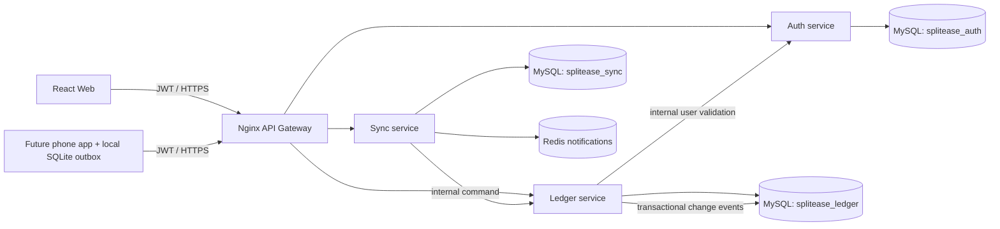
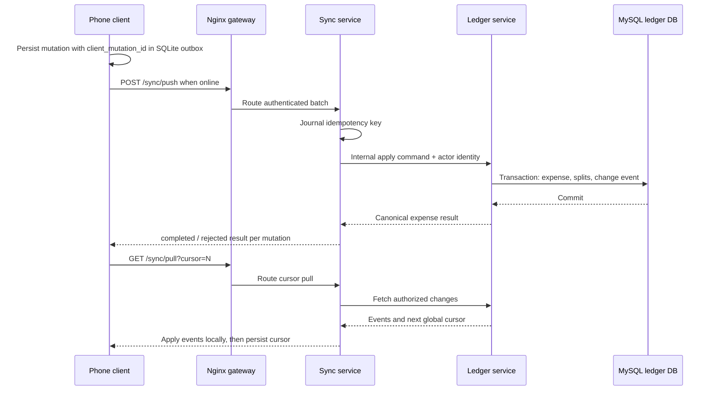

# SplitEase: Full-Stack Architecture Blueprint

SplitEase is a shared-expense ledger for groups and one-to-one friends. The local backend now runs as three FastAPI services (Auth, Ledger, Sync) behind an Nginx gateway, with MySQL 8.4 service-owned databases and Redis for sync notifications. The React web dashboard is still a local-preview UI; a native phone client and payment/OCR integrations are planned follow-up work. This is a runnable development foundation, not a security-audited production deployment.

## Product and System Boundaries

- The server is authoritative for identity, group membership, role checks, expense math, subscription entitlements, and settlement state.
- Clients submit commands and render server-calculated balances; clients never choose the payer identity or declare a settlement successful.
- Expenses and settlements are append-oriented financial records. Corrections are explicit reversals/adjustments rather than destructive edits to historical ledger rows.
- Store amounts as integer minor units (for example, cents) and always store an ISO 4217 currency. Never use floating-point arithmetic for money.
- Group balances are derived from expenses and confirmed settlements. They are not maintained as a mutable balance column.

## Architecture



### Request flow



## Repository Layout

```text
splitease/
├── compose.yaml               # MySQL, Redis, services and gateway
├── infra/
│   ├── gateway/nginx.conf
│   └── mysql/init/             # service databases and least-privilege users
├── apps/
│   ├── web/                    # React + TypeScript, Vite, responsive admin/dashboard
│   │   └── src/{app,features,components,api,theme}/
│   └── mobile/                 # React Native + Expo, shared TypeScript DTOs
│       └── src/{app,features,navigation,components,theme}/
├── services/
│   ├── common/                 # JWT verification, config, SQLAlchemy helpers
│   ├── auth/                   # Auth API, models and Alembic history
│   ├── ledger/                 # Groups, friend ledgers, expenses, balances
│   ├── sync/                   # Offline mutation journal and cursor API
│   ├── tests/smoke-test.ps1
│   ├── Dockerfile
│   └── requirements.txt
├── docs/                       # ADRs, threat model, runbooks
└── README.md
```

Each service owns its MySQL database and Alembic history. User IDs are UUID strings across service boundaries, not cross-database foreign keys. Secrets belong in a secret manager/environment, never in source control.

## Run the Local System

From the repository root in Windows PowerShell:

```powershell
Copy-Item services/.env.example services/.env
# Edit services/.env and replace every local placeholder before sharing the environment.
docker compose --env-file services/.env up --build -d
docker compose --env-file services/.env ps
Invoke-RestMethod http://localhost:8080/health
```

The public local entry point is `http://localhost:8080`. OpenAPI pages are at `/auth/docs`, `/api/docs`, and `/sync/docs`. Run the API smoke test with `.\services\tests\smoke-test.ps1`. Stop containers without deleting persisted database data with `docker compose --env-file services/.env down`; avoid `down -v` unless you intentionally want to erase local data. MySQL is not published to the host; use a local tunnel or `docker compose exec mysql ...` for administration.

### Seed the demo account and start the connected web app

The dashboard uses the API gateway through the Vite dev proxy. Start the API stack first, then from `apps/web` run `npm run dev`. The default web URL is `http://localhost:5173`; the Vite proxy forwards `/auth`, `/api`, and `/sync` to `http://localhost:8080`.

Seed a reusable local demo account and sample group/friend expenses from the repository root:

```powershell
.\services\tests\seed-demo.ps1
```

Default local demo login:

```text
Email:    demo@splitease.example.com
Password: LocalDemoPass!2026
```

The script also creates/reuses `maya@splitease.example.com` and `alex@splitease.example.com`, creates the trip/home groups, and adds sample expenses. It checks existing group names and expense descriptions, so rerunning it does not keep duplicating the fixtures. For any non-local/shared environment, set `$env:SPLITEASE_DEMO_PASSWORD` to a private value before running it, and do not use demo credentials in production.

Postman collection and environment exports are in `postman/`. Import both `SplitEase-Local.postman_collection.json` and `SplitEase-Local.postman_environment.json`, select **SplitEase Local**, then run the collection in order. It registers two fresh test accounts and saves their IDs/tokens into the selected environment. There is no seeded application login; the environment's `password` value is used for the test accounts created by the collection.

The sample environment is only for local development. Before deployment, use unique randomly generated secrets, TLS at the edge, managed database backups, production CORS origins, secret rotation, and a deployment-specific migration/release process. Initial Alembic revisions contain explicit schema DDL; subsequent schema changes must be new, reviewed Alembic revisions.

## User Experience

### Web application

Primary navigation: **Overview**, **Groups**, **Activity**, **Reports**, **Settings**. The overview is optimized for frequent scanning and larger groups:

- A balance summary distinguishes **you are owed** (green) from **you owe** (red), with neutral styling for settled balances. Always pair color with signs, labels, and icons for accessibility.
- Group table/list supports search, member count, currency, last activity, outstanding total, and role-aware actions. Use pagination or cursor-based loading for large groups.
- Debt view offers a per-member net balance chart and a settlement timeline. Include a table/list equivalent, exact amounts, and accessible labels; charts must not be the only way to inspect numbers.
- Activity feed is filterable by group, member, date, and event type. Expense details reveal payer, participants, split method, receipt, and edit history.
- Admin settings include member invitations, role management, group currency, archive/delete workflow, and a clear confirmation step for destructive actions.
- Billing settings show current plan, entitlement state, renewal/cancellation state, and a link to the payment provider's portal.

Use a responsive two-column workspace on wide screens and a single-column flow on narrow screens. Keep dense financial data tabular and aligned by decimal place. For charts use a restrained palette and explicit values/tooltips.

### Mobile application

Use a bottom navigation bar for **Home**, **Groups**, **Activity**, and **Profile**. The expense quick-add is a focused three-step flow:

1. **Amount**: numeric keypad, currency label, optional note, receipt capture entry point.
2. **Paid by**: select a group member, default to the current user. The API still derives/validates the authenticated payer; clients cannot spoof another user's identity.
3. **Split method**: equal, exact amounts, percentages, or shares. Preview each member's amount and block submission until totals reconcile.

After submission, show a clear success state and the new expense in the group feed. Support draft recovery when the app is interrupted, but do not cache sensitive receipt images longer than needed.

The **Settle Up** screen shows counterpart, amount, currency, payment method/availability, and a final review step. Distinguish “record a cash settlement” from “pay online.” Online payment remains pending until a verified provider webhook confirms it. Show pending, succeeded, failed, and canceled states.

### Visual system

- Fintech visual language: quiet surfaces, high-contrast typography, compact data layouts, clear status colors, and one primary action per screen.
- Define semantic tokens for light/dark themes (`surface`, `text`, `border`, `positive`, `negative`, `warning`, `focus`). Green/red are balance cues, not the only status signal. Check WCAG contrast in both themes.
- Persist theme preference per user and honor OS preference by default. Avoid encoding status solely by hue.
- Display recognizable Apple Pay, Google Pay, and Stripe badges only when that method is available in the user's region/device and actually enabled. Do not imply an endorsement or successful payment.
- Web charting can use Recharts; React Native charting can use Victory Native. Keep chart calculations in the shared domain/API contract, not in chart components.

## API Contract

The gateway publishes these running routes. Authenticate with `Authorization: Bearer <access_token>`; access tokens expire after 15 minutes and refresh tokens rotate.

| Area | Endpoint | Authorization / intent |
|---|---|---|
| Auth | `POST /auth/register`, `POST /auth/login` | Public; bcrypt password hashing, access token and refresh token response |
| Auth | `POST /auth/refresh`, `POST /auth/logout`, `GET /auth/me` | Refresh token rotation/revocation; current user endpoint requires access token |
| Groups | `POST /api/v1/groups`, `GET /api/v1/groups` | Create a group with active users; list only groups where caller is an active member |
| Members | `GET /api/v1/groups/{group_id}/members`, `POST /api/v1/groups/{group_id}/members` | Listing requires membership; adding a member is owner/admin only and verifies the target user with Auth over the private service network |
| Group expenses | `POST /api/v1/groups/{group_id}/expenses`, `GET /api/v1/groups/{group_id}/expenses` | Active member; payer and every split participant must be active members; mutation ID is idempotent |
| Direct friends | `POST /api/v1/friends/{friend_user_id}/expenses` | Authenticated user; creates/reuses a private two-person ledger and equal split |
| Balances | `GET /api/v1/groups/{group_id}/balances` | Active member only; computed from expenses, splits, and settlements |
| Settlements | `POST /api/v1/groups/{group_id}/settlements` | A participant records a manual settlement; direction and amount are checked against current debt |
| Offline sync | `POST /sync/push`, `GET /sync/pull?cursor=N` | Authenticated phone; batched idempotent mutations and membership-filtered change feed |
| Sync status | `GET /sync/mutations/{client_mutation_id}` | Caller can inspect only their own mutation status |

The following are planned, not implemented in these containers yet: receipt upload/OCR, currency conversion, subscription checkout/entitlements, online Stripe Connect settlement, account recovery/MFA, expense editing/reversal, and full invitation/removal flows.

### Phone sync protocol

The phone is responsible for a durable local SQLite outbox. It creates a UUID `client_mutation_id` before displaying a new expense as queued, retains the operation while offline, and retries the same ID after reconnection. Never generate a new mutation ID for a retry. The API accepts batches of up to 50. A response can be `completed`, `rejected`, or remain `pending` after a temporary service failure. Remove a local mutation only after `completed`; retain or let the user correct `rejected` operations.

```json
{
    "device_id": "e1dd9ec3-e8ec-4378-8dbb-f0142ca8144d",
    "mutations": [{
        "client_mutation_id": "569ceea2-ea42-43a6-b020-44f843e1c381",
        "kind": "group_expense.create",
        "group_id": "51e36fed-22b0-451c-a860-d14a20544c42",
        "description": "Groceries",
        "amount_minor": 4280,
        "currency": "USD",
        "split_method": "exact",
        "splits": [
            {"user_id": "6a9b0781-67c1-4235-ae6a-47d12bf9681f", "owed_minor": 2140},
            {"user_id": "2e7ac278-929f-48ac-96de-5c6645d6e032", "owed_minor": 2140}
        ]
    }]
}
```

For 1:1 charges use `kind: "friend_expense.create"` and `friend_user_id` instead of `group_id`/`splits`. After push, pull `/sync/pull?cursor=<last-applied-cursor>`. Apply each returned change to the local database in one transaction, then persist the returned cursor only after the local transaction commits. If local application fails, retry from the old cursor; duplicate events are expected and should be applied idempotently by `entity_id`/event cursor. Store refresh credentials only in Keychain/Keystore on phones. Server database remains authoritative; offline edits to already-synced financial rows are not last-write-wins and need explicit reversal/adjustment commands.

Never accept a `user_id` as proof of identity. A UUID is an identifier, not an authorization check. Apply authorization to every object lookup and mutation, including nested expense, split, receipt, and settlement routes.

## Database Schema (SQLAlchemy 2.x)

The running implementation uses service-owned databases: Auth has `users` and `refresh_sessions`; Ledger has `groups`, `group_members`, `expenses`, `expense_splits`, `settlements`, and `change_events`; Sync has `sync_mutations`. Runtime models are in `services/auth/app/models.py`, `services/ledger/app/models.py`, and `services/sync/app/models.py`. Cross-service user IDs are `CHAR(36)` UUID strings; do not add cross-database foreign keys. Ledger verifies user existence through an internal Auth endpoint and applies object-level membership checks locally.

The following compact model example is the original conceptual monolith sketch, not the runtime mapping; use the service-owned models above when implementing features.

Core invariants:

- `group_members` has one row per user/group and carries role/status; membership is the authorization source.
- An expense belongs to one group and has a payer who is an active member of that group.
- Split amounts sum exactly to the expense total in the same currency. For percentage splits, calculate minor units deterministically and assign rounding remainder using a documented stable rule.
- A settlement has a payer (who owes) and payee (who is owed); both are group members. A provider-backed settlement affects balances only after successful confirmation.
- Enforce invariants in service transactions and database constraints where possible. Use `NUMERIC` only if supporting fractional asset units; ordinary fiat accounting uses integer minor units.

```python
# Conceptual monolith example only; see services/ledger/app/models.py for runtime mappings.
import uuid
from datetime import datetime

from sqlalchemy import (
    BigInteger, Boolean, CheckConstraint, DateTime, ForeignKey, Index,
    Integer, String, UniqueConstraint, Uuid, func,
)
from sqlalchemy.orm import DeclarativeBase, Mapped, mapped_column


class Base(DeclarativeBase):
    pass


class User(Base):
    __tablename__ = "users"

    id: Mapped[uuid.UUID] = mapped_column(Uuid, primary_key=True, default=uuid.uuid4)
    email: Mapped[str] = mapped_column(String(320), unique=True, index=True)
    password_hash: Mapped[str] = mapped_column(String(255))
    display_name: Mapped[str] = mapped_column(String(120))
    is_pro: Mapped[bool] = mapped_column(Boolean, nullable=False, default=False, server_default="false")
    is_active: Mapped[bool] = mapped_column(Boolean, nullable=False, default=True, server_default="true")
    created_at: Mapped[datetime] = mapped_column(DateTime(timezone=True), server_default=func.now())


class Group(Base):
    __tablename__ = "groups"

    id: Mapped[uuid.UUID] = mapped_column(Uuid, primary_key=True, default=uuid.uuid4)
    name: Mapped[str] = mapped_column(String(120), nullable=False)
    base_currency: Mapped[str] = mapped_column(String(3), nullable=False, default="USD")
    created_by: Mapped[uuid.UUID] = mapped_column(ForeignKey("users.id", ondelete="RESTRICT"), nullable=False)
    created_at: Mapped[datetime] = mapped_column(DateTime(timezone=True), server_default=func.now())


class GroupMember(Base):
    __tablename__ = "group_members"
    __table_args__ = (
        UniqueConstraint("group_id", "user_id", name="uq_group_members_group_user"),
        CheckConstraint("role IN ('owner', 'admin', 'member')", name="ck_group_members_role"),
        CheckConstraint("status IN ('invited', 'active', 'removed')", name="ck_group_members_status"),
        Index("ix_group_members_user_status", "user_id", "status"),
    )

    id: Mapped[uuid.UUID] = mapped_column(Uuid, primary_key=True, default=uuid.uuid4)
    group_id: Mapped[uuid.UUID] = mapped_column(ForeignKey("groups.id", ondelete="CASCADE"), nullable=False)
    user_id: Mapped[uuid.UUID] = mapped_column(ForeignKey("users.id", ondelete="RESTRICT"), nullable=False)
    role: Mapped[str] = mapped_column(String(16), nullable=False, default="member")
    status: Mapped[str] = mapped_column(String(16), nullable=False, default="active")
    joined_at: Mapped[datetime | None] = mapped_column(DateTime(timezone=True))


class Expense(Base):
    __tablename__ = "expenses"
    __table_args__ = (
        CheckConstraint("amount_minor > 0", name="ck_expenses_amount_positive"),
        CheckConstraint("length(currency) = 3", name="ck_expenses_currency_length"),
        Index("ix_expenses_group_created", "group_id", "created_at"),
    )

    id: Mapped[uuid.UUID] = mapped_column(Uuid, primary_key=True, default=uuid.uuid4)
    group_id: Mapped[uuid.UUID] = mapped_column(ForeignKey("groups.id", ondelete="RESTRICT"), nullable=False)
    paid_by_user_id: Mapped[uuid.UUID] = mapped_column(ForeignKey("users.id", ondelete="RESTRICT"), nullable=False)
    created_by_user_id: Mapped[uuid.UUID] = mapped_column(ForeignKey("users.id", ondelete="RESTRICT"), nullable=False)
    description: Mapped[str] = mapped_column(String(240), nullable=False)
    amount_minor: Mapped[int] = mapped_column(BigInteger, nullable=False)
    currency: Mapped[str] = mapped_column(String(3), nullable=False)
    split_method: Mapped[str] = mapped_column(String(16), nullable=False)
    occurred_at: Mapped[datetime] = mapped_column(DateTime(timezone=True), nullable=False)
    created_at: Mapped[datetime] = mapped_column(DateTime(timezone=True), server_default=func.now())
    reversed_at: Mapped[datetime | None] = mapped_column(DateTime(timezone=True))


class ExpenseSplit(Base):
    __tablename__ = "expense_splits"
    __table_args__ = (
        UniqueConstraint("expense_id", "user_id", name="uq_expense_splits_expense_user"),
        CheckConstraint("owed_minor >= 0", name="ck_expense_splits_owed_nonnegative"),
        Index("ix_expense_splits_user", "user_id"),
    )

    id: Mapped[uuid.UUID] = mapped_column(Uuid, primary_key=True, default=uuid.uuid4)
    expense_id: Mapped[uuid.UUID] = mapped_column(ForeignKey("expenses.id", ondelete="RESTRICT"), nullable=False)
    user_id: Mapped[uuid.UUID] = mapped_column(ForeignKey("users.id", ondelete="RESTRICT"), nullable=False)
    owed_minor: Mapped[int] = mapped_column(BigInteger, nullable=False)
    currency: Mapped[str] = mapped_column(String(3), nullable=False)


class Settlement(Base):
    __tablename__ = "settlements"
    __table_args__ = (
        CheckConstraint("amount_minor > 0", name="ck_settlements_amount_positive"),
        CheckConstraint("payer_user_id <> payee_user_id", name="ck_settlements_distinct_users"),
        CheckConstraint(
            "status IN ('pending', 'succeeded', 'failed', 'canceled', 'recorded')",
            name="ck_settlements_status",
        ),
        UniqueConstraint("idempotency_key", name="uq_settlements_idempotency_key"),
        Index("ix_settlements_group_created", "group_id", "created_at"),
    )

    id: Mapped[uuid.UUID] = mapped_column(Uuid, primary_key=True, default=uuid.uuid4)
    group_id: Mapped[uuid.UUID] = mapped_column(ForeignKey("groups.id", ondelete="RESTRICT"), nullable=False)
    payer_user_id: Mapped[uuid.UUID] = mapped_column(ForeignKey("users.id", ondelete="RESTRICT"), nullable=False)
    payee_user_id: Mapped[uuid.UUID] = mapped_column(ForeignKey("users.id", ondelete="RESTRICT"), nullable=False)
    amount_minor: Mapped[int] = mapped_column(BigInteger, nullable=False)
    currency: Mapped[str] = mapped_column(String(3), nullable=False)
    status: Mapped[str] = mapped_column(String(16), nullable=False, default="pending")
    provider: Mapped[str | None] = mapped_column(String(24))
    provider_reference: Mapped[str | None] = mapped_column(String(160), unique=True)
    idempotency_key: Mapped[str] = mapped_column(String(128), nullable=False)
    created_at: Mapped[datetime] = mapped_column(DateTime(timezone=True), server_default=func.now())
    confirmed_at: Mapped[datetime | None] = mapped_column(DateTime(timezone=True))
```

For stricter referential integrity, add MySQL composite foreign keys ensuring group-owned payer/split/settlement users are members of the same group, or enforce it with a transactionally locked domain service. The live implementation verifies membership in service code because identity and ledger data are deliberately in separate databases. Add migrations and tests before changing these invariants.

A production schema should also add `refresh_tokens` (hashed token/session id, expiry, revoked time), `subscription_events`, `receipt_assets`, `audit_events`, and optionally `exchange_rates`/`expense_conversions`. Do not store raw refresh tokens or payment card data.

## Secure FastAPI Patterns

Suggested dependencies: `fastapi`, `uvicorn`, `sqlalchemy[asyncio]`, `asyncpg`, `alembic`, `PyJWT`, and `bcrypt`. Pin versions and run dependency/security scanning. Configure JWT keys via a secret manager, use a short access-token TTL, rotate refresh tokens, and support revocation. For high-risk deployments, use asymmetric signing keys and key rotation (`kid`).

```python
# Conceptual auth example only; runtime JWT helpers are in services/common/security.py.
from datetime import datetime, timedelta, timezone
from uuid import UUID

import bcrypt
import jwt
from fastapi import Depends, HTTPException, status
from fastapi.security import OAuth2PasswordBearer
from sqlalchemy.ext.asyncio import AsyncSession

from app.core.settings import settings
from app.db.session import get_session
from app.models.core import User
from app.repositories.users import get_user_by_id


oauth2_scheme = OAuth2PasswordBearer(tokenUrl="/api/v1/auth/login")


def hash_password(password: str) -> str:
    return bcrypt.hashpw(password.encode("utf-8"), bcrypt.gensalt(rounds=12)).decode("utf-8")


def verify_password(password: str, password_hash: str) -> bool:
    try:
        return bcrypt.checkpw(password.encode("utf-8"), password_hash.encode("utf-8"))
    except ValueError:
        return False


def create_access_token(user_id: UUID) -> str:
    now = datetime.now(timezone.utc)
    claims = {
        "sub": str(user_id),
        "iat": now,
        "exp": now + timedelta(minutes=settings.access_token_minutes),
        "iss": settings.jwt_issuer,
        "aud": settings.jwt_audience,
        "typ": "access",
    }
    return jwt.encode(claims, settings.jwt_signing_key, algorithm=settings.jwt_algorithm)


async def get_current_user(
    token: str = Depends(oauth2_scheme),
    session: AsyncSession = Depends(get_session),
) -> User:
    unauthorized = HTTPException(
        status_code=status.HTTP_401_UNAUTHORIZED,
        detail="Invalid authentication credentials",
        headers={"WWW-Authenticate": "Bearer"},
    )
    try:
        claims = jwt.decode(
            token,
            settings.jwt_verification_key,
            algorithms=[settings.jwt_algorithm],
            issuer=settings.jwt_issuer,
            audience=settings.jwt_audience,
            options={"require": ["sub", "exp", "iat", "iss", "aud"]},
        )
        if claims.get("typ") != "access":
            raise unauthorized
        user_id = UUID(claims["sub"])
    except (jwt.PyJWTError, ValueError, KeyError):
        raise unauthorized

    user = await get_user_by_id(session, user_id)
    if user is None or not user.is_active:
        raise unauthorized
    return user
```

Never put passwords, provider secrets, or sensitive profile data in JWT claims. On web, prefer secure, HttpOnly, SameSite cookies for refresh tokens and protect cookie-authenticated state-changing requests against CSRF. On mobile, use Keychain/Keystore-backed secure storage. Rate-limit registration/login/reset endpoints and return generic login errors.

### Group guard and role checks

The guard below intentionally returns `404` when the group or membership is unavailable, avoiding a group-existence oracle. Route handlers must use it before loading group-owned objects; do not fetch by expense ID alone and authorize afterward.

```python
# Conceptual group guard; runtime membership enforcement is in services/ledger/app/main.py.
from dataclasses import dataclass
from uuid import UUID

from fastapi import Depends, HTTPException
from sqlalchemy import select
from sqlalchemy.ext.asyncio import AsyncSession

from app.core.security import get_current_user
from app.db.session import get_session
from app.models.core import Group, GroupMember, User


@dataclass(frozen=True)
class GroupAccess:
    group: Group
    role: str


async def require_group_member(
    group_id: UUID,
    user: User = Depends(get_current_user),
    session: AsyncSession = Depends(get_session),
) -> GroupAccess:
    result = await session.execute(
        select(Group, GroupMember.role)
        .join(GroupMember, GroupMember.group_id == Group.id)
        .where(
            Group.id == group_id,
            GroupMember.user_id == user.id,
            GroupMember.status == "active",
        )
    )
    row = result.one_or_none()
    if row is None:
        raise HTTPException(status_code=404, detail="Group not found")
    return GroupAccess(group=row[0], role=row[1])


def require_admin(access: GroupAccess = Depends(require_group_member)) -> GroupAccess:
    if access.role not in {"owner", "admin"}:
        raise HTTPException(status_code=403, detail="Insufficient group role")
    return access
```

### Expense creation: validate and commit atomically

This route shape demonstrates the trust boundary. The request schema should reject duplicate split users and invalid split methods; the service additionally checks group membership, currency, positive amounts, and exact arithmetic. Production code should use a transaction and idempotency key for retried client submissions.

```python
# Conceptual route; runtime expense handlers are in services/ledger/app/main.py.
from datetime import datetime
from uuid import UUID

from fastapi import APIRouter, Depends, HTTPException, status
from pydantic import BaseModel, Field
from sqlalchemy import select
from sqlalchemy.ext.asyncio import AsyncSession

from app.api.dependencies.groups import GroupAccess, require_group_member
from app.core.security import get_current_user
from app.db.session import get_session
from app.models.core import Expense, ExpenseSplit, GroupMember, User

router = APIRouter(prefix="/groups/{group_id}/expenses", tags=["expenses"])


class SplitInput(BaseModel):
    user_id: UUID
    owed_minor: int = Field(ge=0)


class ExpenseCreate(BaseModel):
    description: str = Field(min_length=1, max_length=240)
    amount_minor: int = Field(gt=0)
    currency: str = Field(pattern=r"^[A-Z]{3}$")
    split_method: str = Field(pattern=r"^(equal|exact|percentage|shares)$")
    occurred_at: datetime
    splits: list[SplitInput] = Field(min_length=1)


@router.post("", status_code=status.HTTP_201_CREATED)
async def create_expense(
    group_id: UUID,
    payload: ExpenseCreate,
    access: GroupAccess = Depends(require_group_member),
    user: User = Depends(get_current_user),
    session: AsyncSession = Depends(get_session),
):
    if access.group.id != group_id:
        raise HTTPException(status_code=404, detail="Group not found")
    split_user_ids = [item.user_id for item in payload.splits]
    if len(split_user_ids) != len(set(split_user_ids)):
        raise HTTPException(status_code=422, detail="Each member may appear once")
    if sum(item.owed_minor for item in payload.splits) != payload.amount_minor:
        raise HTTPException(status_code=422, detail="Splits must equal the expense total")

    member_result = await session.execute(
        select(GroupMember.user_id).where(
            GroupMember.group_id == group_id,
            GroupMember.status == "active",
            GroupMember.user_id.in_(set(split_user_ids) | {user.id}),
        )
    )
    active_members = set(member_result.scalars().all())
    if active_members != set(split_user_ids) | {user.id}:
        raise HTTPException(status_code=422, detail="All expense participants must be active members")

    expense = Expense(
        group_id=group_id,
        paid_by_user_id=user.id,
        created_by_user_id=user.id,
        description=payload.description,
        amount_minor=payload.amount_minor,
        currency=payload.currency,
        split_method=payload.split_method,
        occurred_at=payload.occurred_at,
    )
    session.add(expense)
    await session.flush()
    session.add_all([
        ExpenseSplit(
            expense_id=expense.id,
            user_id=item.user_id,
            owed_minor=item.owed_minor,
            currency=payload.currency,
        )
        for item in payload.splits
    ])
    await session.commit()
    return {"id": str(expense.id), "group_id": str(group_id), "status": "recorded"}
```

The route commits the session transaction that the request dependencies may already have opened; dependency cleanup must roll it back when validation or persistence fails. In production, use a service-level transaction consistently and lock or otherwise protect the active-membership check against concurrent removal. Validate that the group currency policy allows the submitted currency, and derive the canonical expense currency from server policy where appropriate. Add `Idempotency-Key` handling so a retry cannot create duplicate expenses.

## Balance and Split Rules

For one currency, each member's net is total paid minus total owed, plus/minus confirmed settlements according to payer/payee direction. A positive result means the group owes that member. Do not combine currencies by summing nominal amounts. When Pro multi-currency is enabled, preserve original currency amounts and persist the conversion rate, rate source, and conversion timestamp used for group reporting; show original and converted amounts.

Equal split rounding rule example: sort stable participant UUIDs, assign `floor(total / n)` minor units to each, and distribute the remaining units one each in that stable order. Exact splits must add to the total. Percentages should use decimal/integer basis-point arithmetic and resolve remainders with the same documented stable rule. Test negative, zero, very large, and one-minor-unit edge cases.

## Freemium, Pro, and Payment Hooks

### Entitlements

- **Free**: core groups, expense entry, equal/exact split, balances, and activity history. Contextual ads may appear in non-critical surfaces; never target ads using private expense descriptions, counterparties, health data, or inferred financial hardship.
- **Pro**: multi-currency conversion/reporting and receipt OCR, plus any explicitly marketed premium limits/features.
- Store subscription provider customer/subscription identifiers and event history separately from `users.is_pro`. `is_pro` is a cached entitlement projection, not a client-controlled flag or sole source of billing truth.
- Reconcile provider events idempotently; handle grace periods, cancellation-at-period-end, refunds, chargebacks, and webhook replay. Enforce entitlements on API endpoints and jobs, not only by hiding UI.
- OCR runs asynchronously. Upload privately, validate MIME type and byte size, scan files, use short-lived signed URLs, and require user confirmation of extracted merchant/date/amount before creating an expense.

### Stripe Connect mock flow

Use a provider adapter so development can use a deterministic mock and production can use Stripe without changing ledger logic.

```text
Client -> POST payment-intent (settlement id)
API -> authorize payer and verify current debt / amount / currency
API -> create or reuse provider intent with idempotency key
API -> persist settlement status=pending and provider reference
Client -> receives client secret and completes provider UI
Stripe -> signed webhook to /webhooks/stripe
API -> verify signature, deduplicate event, transition pending -> succeeded
API -> record confirmed settlement and recalculate derived balances
```

The mock adapter should simulate pending/success/failure and emit the same internal domain events as the real adapter. Never let a client send `status=succeeded`. Verify webhook signatures against the raw request body, persist processed provider event IDs, make transitions idempotent, and reconcile stale pending payments. Define who is merchant of record, fee handling, refund/dispute behavior, and jurisdictional compliance before enabling live transfers. Stripe Connect availability and supported flows vary by country and account configuration.

## Quality, Operations, and Security Checklist

- **Testing**: unit tests for split rounding and balance derivation; integration tests for every role/object authorization combination; IDOR tests with two unrelated users; webhook replay/idempotency tests; mobile offline/retry tests; browser and device accessibility checks.
- **Database**: Alembic migrations, MySQL backups and restore drills, connection pooling, transaction timeouts, indexes validated with query plans, retention/deletion policy, and audited privileged actions.
- **API**: TLS only, strict CORS allowlist, request size limits, rate limits, structured logs with request IDs, no tokens/receipt contents/passwords in logs, safe error responses, input validation, and security headers.
- **Auth**: bcrypt cost benchmarked on production hardware; password reset tokens hashed, short-lived, single-use; refresh-token rotation and reuse detection; MFA option for group admins; session revocation on password change.
- **Privacy**: data inventory, export/delete workflows, consent and retention rules, encrypted storage/backups, private receipt bucket, least-privilege access, and jurisdiction-specific privacy review.
- **Observability**: metrics for API latency/errors, database pool pressure, payment state transitions, OCR failure rates, and subscription webhook lag. Alert on stuck pending settlements and reconciliation drift.
- **Release**: CI type checks/lint/tests, migration check, dependency scanning, secret scanning, signed builds, staged rollout, feature flags for payments/OCR, and rollback/runbooks.

## Suggested Delivery Sequence

1. Establish contracts, auth/session lifecycle, users, groups, memberships, roles, migrations, and IDOR integration tests.
2. Ship expense and split ledger, derived balances, web group dashboard, mobile quick-add, and activity feeds.
3. Add direct/manual settlement records and settlement history; validate ledger reconciliation.
4. Add subscription provider, server entitlements, and Pro gating; keep UI and API decisions consistent.
5. Add private receipt upload/OCR and multi-currency conversion with explicit rates and auditability.
6. Integrate live payment rails only after compliance, reconciliation, refunds, disputes, and operational runbooks are ready.
